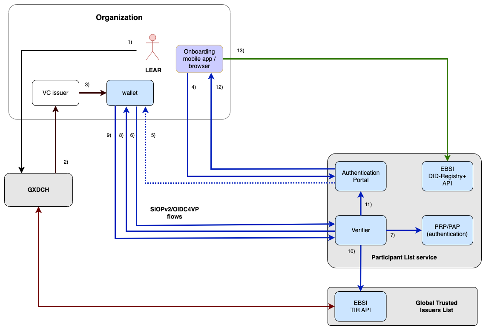
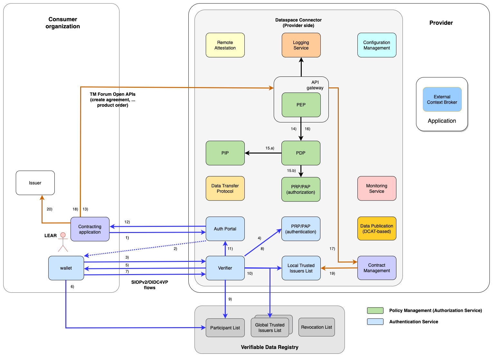
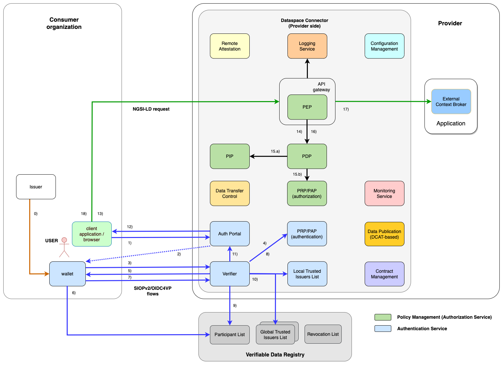
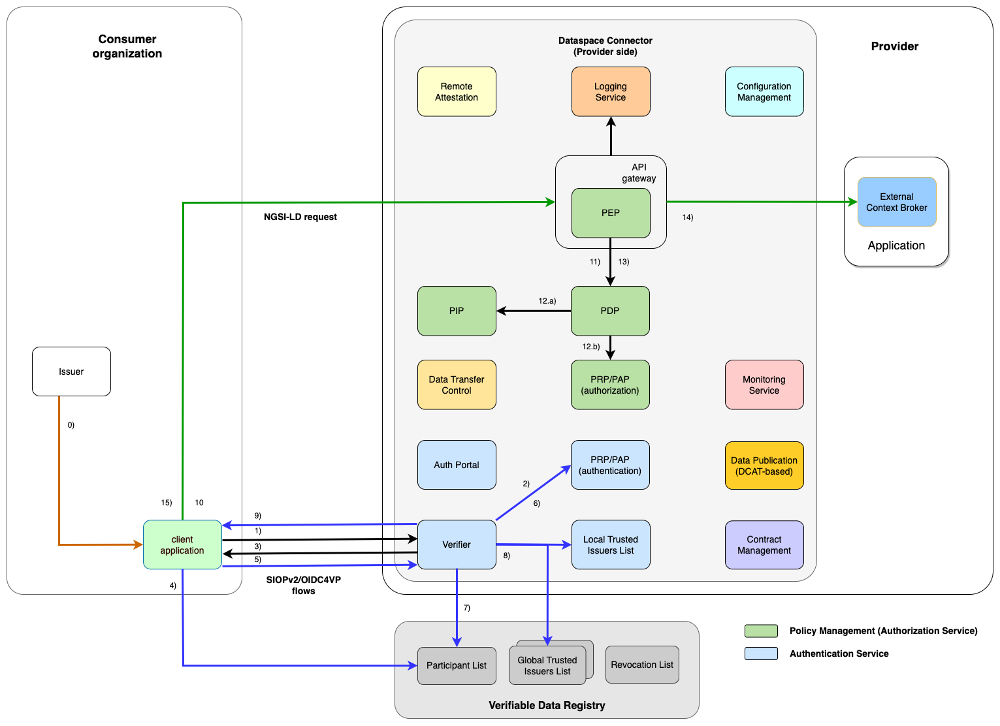

# FIWARE Data Space Connector

This repository provides a description of the FIWARE Data Space Connector which has been developed implementing [DSBA Technical Convergence recommendations](https://data-spaces-business-alliance.eu/wp-content/uploads/dlm_uploads/Data-Spaces-Business-Alliance-Technical-Convergence-V2.pdf) as soon as they become enough mature.

If you want to head over directly to the implementation, go to the 
FIWARE-Ops [data-space-connector repository](https://github.com/FIWARE-Ops/data-space-connector).

<!-- ToC created with: https://github.com/thlorenz/doctoc -->
<!-- Update with: doctoc README.md -->

<strong>Table of Contents</strong>

<!-- START doctoc generated TOC please keep comment here to allow auto update -->
<!-- DON'T EDIT THIS SECTION, INSTEAD RE-RUN doctoc TO UPDATE -->

- [Overview](#overview)
- [Components](#components)
- [Description of flows in a data space](#description-of-flows-in-a-data-space)
  - [Onboarding of an organization in the data space](#onboarding-of-an-organization-in-the-data-space)
  - [Consumer registration](#consumer-registration)
  - [Contract management](#contract-management)
  - [Service interaction](#service-interaction)
    - [Service interaction (H2M)](#service-interaction-h2m)
    - [Service interaction (M2M)](#service-interaction-m2m)
- [Implementation](#implementation)
  - [Examples](#examples)
  - [Contract Management via TMForum APIs](#contract-management-via-tmforum-apis)

<!-- END doctoc generated TOC please keep comment here to allow auto update -->

## Overview

The FIWARE Data Space Connector is an integrated suite of components every organization participating 
in a data space should deploy to “connect” to a data space. Following the DSBA recommendations, it 
allows to: 

* Interface with Trust Services aligned with [EBSI specifications](https://api-pilot.ebsi.eu/docs/apis)
* Implement authentication based on [W3C DID](https://www.w3.org/TR/did-core/) with 
  [VC/VP standards](https://www.w3.org/TR/vc-data-model/) and 
  [SIOPv2](https://openid.net/specs/openid-connect-self-issued-v2-1_0.html#name-cross-device-self-issued-op) / 
  [OIDC4VP](https://openid.net/specs/openid-4-verifiable-presentations-1_0.html#request_scope) protocols
* Implement authorization based on attribute-based access control (ABAC) following an 
  [XACML P*P architecture](https://www.oasis-open.org/committees/tc_home.php?wg_abbrev=xacml) using 
  [Open Digital Rights Language (ODRL)](https://www.w3.org/TR/odrl-model/) and the 
  [Open Policy Agent (OPA)](https://www.openpolicyagent.org/)
* Provide compatibility with [ETSI NGSI-LD](https://www.etsi.org/committee/cim) as data exchange API
* Supports the [TMForum APIs](https://www.tmforum.org/oda/open-apis/) for contract negotiation

**Note:** Although the FIWARE Data Space Connector provides compatibility with NGSI-LD as data exchange 
API, it could be also used for any other RESTful API by replacing or extending the PDP component of the 
connector.

Above listed functionalities can be used by an organization to connect to the data space in its role 
as data (processing) service provider, consumer of data (processing) services, or both.

Technically, the FIWARE Data Space Connector is a 
[Helm Umbrella-Chart](https://helm.sh/docs/howto/charts_tips_and_tricks/#complex-charts-with-many-dependencies), 
containing all the sub-charts and their dependencies for deployment via Helm.  
Thus, being provided as Helm chart, the FIWARE Data Space Connector can be deployed on 
[Kubernetes](https://kubernetes.io/) environments.

## Components

The following diagram shows a logical overview of the different components of the FIWARE Data Space 
Connector.

Precisely, the connector bundles the following components:

| Component       | Role            | Link |
|-----------------|-----------------|------|
| VCVerifier      | Verifier        | https://github.com/FIWARE/VCVerifier |
| credentials-config-service | Credentials Config provider for the verifier | https://github.com/FIWARE/credentials-config-service |
| Keycloak | Issuer of VCs | https://www.keycloak.org |
| Scorpio        | Context Broker  | https://github.com/ScorpioBroker/ScorpioBroker |
| trusted-issuers-list | Acts as Trusted Issuers List by providing an [EBSI Trusted Issuers Registry](https://api-pilot.ebsi.eu/docs/apis/trusted-issuers-registry) API | https://github.com/FIWARE/trusted-issuers-list |
| APISIX | APISIX as API-Gateway with a sidecar OPA as PEP | https://apisix.apache.org/ / https://www.openpolicyagent.org/ |
| odrl-pap        | PAP allowing to configure ODRL policies to be used by the OPA | https://github.com/wistefan/odrl-pap |
| tmforum-api     | [TMForum APIs](https://www.tmforum.org/oda/open-apis/) for contract management | https://github.com/FIWARE/tmforum-api |
| contract-management | Notification listener for contract management events out of TMForum | https://github.com/FIWARE/contract-management |
| MySQL           | Database | https://www.mysql.com |
| PostgreSQL      | Database | https://www.postgresql.org |
| PostGIS         | PostgreSQL Database with PostGIS extensions | https://postgis.net/ |

**Note,** that some of the components shown in the diagram above are not implemented yet.

## Description of flows in a data space

This section provides a description of various flows and interactions in a data space involving the FIWARE 
Data Space Connector.

### Onboarding of an organization in the data space

Before participating in a data space, an organization needs to be onboarded at the data space's 
Participant List Service by registering it as trusted participant. The user invoking the onboarding 
process needs to present a VC issued by the organization to the user itself, a VC containing the self 
description of the organization and a VC issued by a trusted Compliancy Service for the organization 
self description. 

The following displays the different steps during the onboarding.

**Steps**

* The organization validates that the VC containing its description as organization is compliant with 
  Gaia-X specifications using the services of a Gaia-X Digital Clearing House 
  ([GXDCH](https://gaia-x.eu/gxdch/)) - as a result, a 
  VC is issued by the GXDCH (steps 1-2). That VC will end stored in the wallet of the LEAR either as part 
  of the same process (once the GXDCH implements the OIDC4VCI) or via an issuer of VCs that exists 
  inside the organization (step 3)
* The API for registering the organization is inspired in the DID-Registry API defined by EBSI but 
  extending it to allow: 
  - creation, update and deletion of entries beyond read(ing) of entries
  - authentication with VCs (including the VC issued by a GXDCH)
* Using an onboarding application (or a web portal) the organization’s LEAR requests the authentication 
  into the Participant Lists service which ultimately translates into a request to the Verifier (step 4-6)
  - a page is accessed where a QR for authentication is displayed (step 4)
  - the QR code is scanned through the wallet (step 5) which translates 
  - into a request to the verifier (step 6)
* The verifier checks in the PRP/PAP what VCs it has to request to the wallet (step 7). In principle it will 
  find the following VCs to be requested: 
  1. the LEAR VC accrediting the user as LEAR of the organization, 
  2. the VC containing the description of the organization, and 
  3. the VC issued by some GXDCH acredditing 
  that the previous VC is Gaia-X compliant
* The verifier responds to the previous request sending a VP request to the wallet which responds with 
  the requested VCs (steps 8-9)
* The verifier checks that the LEAR VC has been signed using proper eIDAS certificates and that the GXDCH VC 
  has been issued by a trusted GXDCH (step 10). It finally produces an access token (steps 11-12) which the 
  onboarding application can then use to invoke the EBSI DID-Registry+ API in order to register the 
  organization as data space participant (step 13)

### Consumer registration

Before being able to procure access to the provider's data service, a consumer organization needs to be 
registered at the provider's Trusted Issuers List as trusted issuer of VCs including claims 
representing a buyer of products in the provider's connector.

The following displays the different steps for the consumer registration.

**Steps**

* Using a contracting app (or a web portal), a Legal Entity Appointed Representative (LEAR) of the consumer 
  organization will request authentication into the connector of the service provider (steps 1-3 involving 
  scanning of QR code using the wallet)
* The Verifier will request from the user’s wallet a VC that acredits him/her as LEAR of the organization, 
  eventually other VCs (steps 4-5). The wallet will check whether the verifier belongs to a participant in the 
  data space (step 6) and return the requested VCs (step 7)
* The Verifier checks whether the LEAR’s VC was issued by a trusted participant of the data space (steps 8-9), 
  and also checks whether other VCs required were issued by trusted issuers (step 10)
* If verifications were ok, it issues a token (step 11) that is transmitted to the user (step 12)
* Using the returned token, the user invokes [TM Forum API](https://www.tmforum.org/oda/open-apis/) to register 
  the consumer organization at the Connector 
  (steps 13-17) establishing the necessary access control (steps 13-14)
* Once the organization is registered and fulfills all the necessary information (which may take some time), 
  the organization is registered in the local trusted issuers list as trusted issuer of VCs which include claims 
  as buyer of products in the connector (step 18)

  
  
### Contract management

After the registration, the consumer organization can perform contract negotiation, e.g., in order to 
procure access to a specific service linked to a product of the provider.

The following displays the different steps for the contract negotiation.

**Steps**

* A LEAR of the consumer organization will start authentication into the contract negotiation module of the 
  connector of a service provider (steps 1-3 involving scanning of QR code using the wallet)
* The Verifier will request to the user (via his/her wallet) for VCs that acredit 
  1. the user is a LEAR of the organization, 
  2. (s)he owns credentials connected to roles meaningful for contract negotiation that the organization issued to the user and 
  3. some other VCs (steps 4-5). The wallet will check that the verifier belongs to a participant in the data space (step 6) and return the requested VCs (step 7)
* The Verifier checks whether the LEAR’s VC was issued by a trusted participant of the data space (step 8), 
  and rest of VCs required were issued by trusted issuers (step 9). Note that the VC for accessing contract 
  negotiation functions requires that the organization were previously registered in the contract negotiation 
  module, otherwise it will not be found in local trusted issuers registry
* If verifications were ok, it issues a token (step 10) that is transmitted to the user (step 11)
* Using the returned token, the user invokes TM Forum API to perform operations on the contract negotiation 
  module (steps 12-17) establishing the necessary access control (steps 12-14)
* Once the organization is registered and fulfills all the necessary information (which may take some time), 
  the organization is registered as trusted issuer of VCs which include claims as valid user of products accessible 
  via the connector (step 18) 

### Service interaction

Once the procurement has been completed, a user or an application of the consumer organization can interact 
with the actual service offered by the provider, e.g., an NGSI-LD based data (processing) service. 

In the case of a user interacting with the service, this is a Human-To-Machine (H2M) interaction. 

In the other case of an application interacting with the service, this is a 
Machine-To-Machine (M2M) interaction. 

The following displays the different steps for the two different types of interactions

#### Service interaction (H2M)

**Steps**

* A user of the product (employee or customer of the consumer oganization that was issued a VC in step 0 that 
  acredits him/her as user playing a role relevant to the business logic of the product) request authentication 
  in the connector (steps 1-3 involving scanning of QR code using the wallet)
* The Verifier will request to the user (via his/her wallet) for VCs that acredit 
  1. the user owns credentials connected to roles meaningful for the given product/application and 
  2. some other VCs (steps 4-5). 
  
  The wallet will check that the verifier belongs to a participant in the data space (step 6) and return the 
  requested VCs (step 7)
* Verifier verifies whether the VC was issued by an organization that 
  1. is a trusted participant of the data space (step 8) and 
  2. is a trusted issuer of the VCs meaningful for the application (that is, VCs only organizations that ordered the product can issue), also checks whether other VCs required were issued by trusted issuers (steps 9)
* If verifications were ok, it issues a token (step 10) that is transmitted to the user (step 11)
* Using the returned token, the user invokes services of the product (step 12)
* The PEP proxy and PDP will verify whether a user with the claims (attributes) included in the VCs extracted 
  from the token is authorized to perform the given request (steps 13-15)
* If authorization is ok, the request is forwarded (step 16) and a response returned to the user (step 17)

#### Service interaction (M2M)

**Steps**

* An application from the consumer organization that acquired rights to use a product requests its 
  authentication in the connector (steps 1)
* The Verifier will request to the application for VCs that acredit 
  1. the application owns credentials connected to roles meaningful for the given product/application and 
  2. some other VCs (steps 2-3). 
  
  The wallet will check that the verifier belongs to a participant in the data space (step 4) and 
  returns the requested VCs (step 5)
* Verifier verifies whether the VC was issued by an organization that is a trusted participant of the 
  data space (step 6) and is a trusted issuer of the VCs meaningful for the application (that is, VCs that 
  only organizations that ordered the product can issue), also checks whether other VCs required were issued 
  by trusted issuers (steps 7)
* If verifications were ok, it issues a token that is transmitted to the application (steps 8)
* Using the returned token, the application invokes services of the product (step 9)
* The PEP proxy and PDP will verify whether the application with the claims (attributes) included in the VCs 
  extracted from the token is authorized to perform the given request (steps 10-12)
* If authorization is ok, the request is forwarded (step 13) and a response returned to the app (step 14)

A detailed description of the steps to be performed by client applications and service providers can be found 
in the [Service Interaction (M2M)](./doc/flows/service-interaction-m2m) documentation. 

## Implementation

The implementation of the FIWARE Data Space Connector can be found at 
the FIWARE-Ops [data-space-connector repository](https://github.com/FIWARE-Ops/data-space-connector), 
which also provides instructions for the deployment.

### Examples

* Various examples for the deployment of the FIWARE Data Space Connector, including an 
entire "Minimal Viable Dataspace", can be found in the 
  [examples](https://github.com/FIWARE-Ops/data-space-connector/tree/main/examples) folder of the 
  FIWARE-Ops [data-space-connector repository](https://github.com/FIWARE-Ops/data-space-connector)
* A description and ArgoCD-based deployment of a full demo-setup of a data space following the DSBA recommendations, 
  including a data service provider based on the FIWARE Data Space Connector, can be found at the 
  FIWARE-Ops [fiware-gitops repository](https://github.com/FIWARE-Ops/fiware-gitops/tree/master/aws/dsba)
  

### Contract Management via TMForum APIs

A detailed description of the contract management via TMForum APIs can be found in 
the [Contract Management](./doc/flows/contract-management) documentation.

