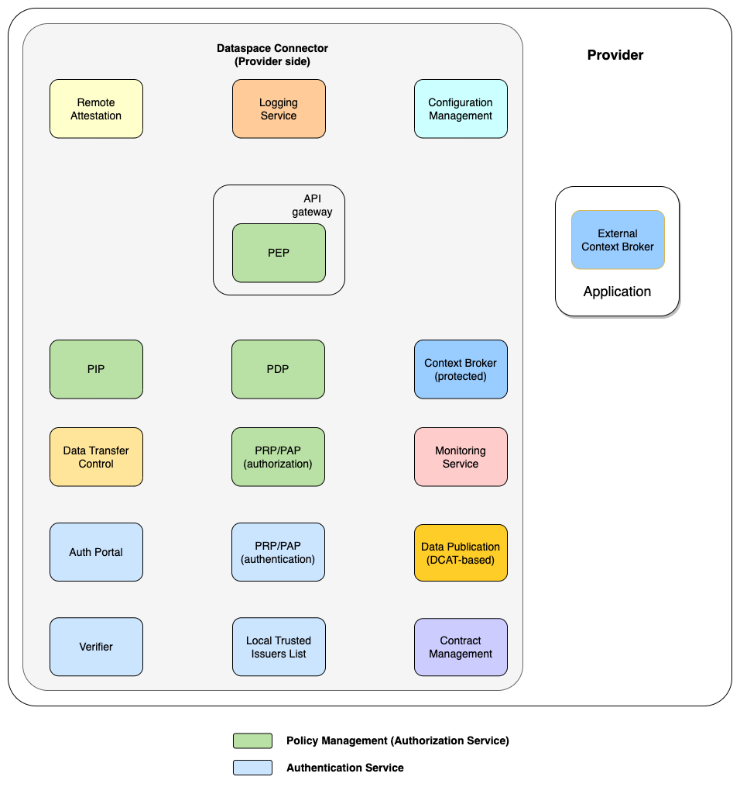

# FIWARE Dataspace Connector

Este repositorio forma parte del diseño e implementación de una **arquitectura tecnológica modular y escalable**, alineada con estándares europeos como **Gaia-X** y **FIWARE**, cuyo fin es garantizar la **interoperabilidad y soberanía de datos** en entornos de movilidad inteligente.

Los objetivos principales del despliegue son:

1. **Arquitectura técnica**  
   Construcción de un entorno Dataspace FIWARE (Scorpio Broker, Keycloak, APISIX, TIR/TIL, bases de datos) desplegado sobre **K3s** y **Helm**, como prueba de concepto de un sistema **federado y portable**.

2. **Interoperabilidad y FAIR**  
   Uso de vocabularios y modelos de datos **NGSI-LD** que cumplen con los principios **FAIR (Findable, Accessible, Interoperable, Reusable)** para facilitar el intercambio de información entre participantes.

3. **Procesamiento de datos con IA**  
   Base para el desarrollo de **algoritmos de análisis de patrones de tráfico y optimización de movilidad para vehículos autónomos**, consumiendo datos a través del broker.

4. **Seguridad y privacidad**  
   Integración de **PETs (Privacy Enhancing Technologies)**, control de acceso con **ODRL policies** y autenticación mediante **Keycloak**, asegurando que los datos se comparten de forma confiable y conforme a normativa.

5. **Validación**  
   Pruebas técnicas para comprobar la **persistencia de datos**, el funcionamiento de los flujos de acceso y la **robustez del sistema** frente a reinicios y escenarios de fallo.


---

## Requisitos

- Docker (>= 24.x)
- Maven (>= 3.8.x)
- Git
- Acceso a internet para descargar imágenes
- Linux (Ubuntu recomendado)

---

## Despliegue

Clona el repositorio:

```bash
git clone https://github.com/CristianBM91/fiware-dataspace.git
cd fiware-dataspace
```

Despliega el dataspace:

```bash
mvn clean deploy -Plocal
```

En otra terminal, configura el contexto de kubectl:

```bash
export  KUBECONFIG=$(pwd)/target/k3s.yaml
```

Supervisa el estado del despliegue:
```bash
watch kubectl get pods -A
```

Persistencia entre reinicios

El k3s-maven-plugin crea un contenedor efímero llamado k3s-maven-plugin.
Si no se renombra, al reiniciar la máquina Maven lo borrará automáticamente.
Para evitarlo, renómbralo:
```bash
docker rename k3s-maven-plugin k3s-keep
```

Configura el local-path-provisioner como StorageClass por defecto para que los PVCs se creen automáticamente:
```bash
kubectl patch storageclass local-path -p '{"metadata": {"annotations":{"storageclass.kubernetes.io/is-default-class":"true"}}}'
```

Comprueba que los volúmenes están creados y ligados:
```bash
kubectl get pvc -A
```

Si todo está bien, deberías ver STATUS=Bound en las bases de datos y Scorpio.

## Arquitectura



### Keycloak
El componente de **Keycloak** se utiliza para la **gestión de identidades y control de acceso** dentro del dataspace:

- Autenticación y autorización de usuarios y servicios.
- Registro de clientes (por ejemplo, Scorpio, APISIX, aplicaciones externas).
- Emisión de **tokens OIDC** utilizados para acceder a los datos a través de APISIX.
- Definición de roles y realms alineados con los participantes del ecosistema.

> 📄 Para más detalles sobre la configuración de usuarios, clientes y realms, consulta la guía [docs/keycloak.md](docs/keycloak.md).

---

### Scorpio Broker (NGSI-LD)
El **Scorpio Broker** es el **context broker** del dataspace.  
Permite almacenar, consultar y suscribirse a entidades en formato **NGSI-LD**:

- Publicación de entidades semánticas.
- Consulta de entidades por ID o mediante filtros.
- Persistencia en **PostGIS** para datos estructurados.
- Integración con políticas ODRL y control de acceso vía APISIX.

> 📄 Ver ejemplos de uso en [docs/ngsi-ld.md](docs/ngsi-ld.md).

---

### Políticas ODRL
Las **políticas ODRL (Open Digital Rights Language)** definen **qué datos pueden compartirse, bajo qué condiciones y con qué restricciones**:

- Declaración de permisos y prohibiciones.
- Restricciones por roles, propósito o duración.
- Asociación de políticas a datasets publicados en el dataspace.
- Soporte en Scorpio y APISIX para aplicar dichas políticas.

> 📄 Más información en [docs/policies.md](docs/policies.md).

---

### APISIX Gateway
**APISIX** actúa como **API Gateway** del dataspace.  
Se encarga de:

- Exponer endpoints públicos de forma segura.  
- Validar tokens emitidos por Keycloak antes de reenviar peticiones.  
- Aplicar **políticas de acceso** (ODRL, RBAC).  
- Gestionar certificados y TLS para tráfico seguro.  

> 📄 Configuración y ejemplos en [docs/apisix.md](docs/apisix.md).

---

### Bases de datos
El dataspace incluye varias bases de datos para garantizar la persistencia:

- **PostgreSQL** → usada por componentes como Scorpio.  
- **MySQL** → usada por el Trust Anchor y servicios de credenciales.  
- **MongoDB** → usada para almacenamiento auxiliar en algunos módulos.  
- **etcd** → base de datos distribuida que coordina APISIX y servicios internos.  

Todos estos servicios están configurados con **PVCs y persistencia habilitada** para mantener los datos tras reinicios.

> 📄 Detalles técnicos en [docs/databases.md](docs/databases.md).

---

### Trust Anchor (TIR/TIL)
El **Trust Anchor** asegura la confianza entre participantes en el dataspace.  
Incluye:

- **Trusted Issuers Registry (TIR):** lista de emisores de credenciales confiables.  
- **Trusted Issuers List (TIL):** API para consultar, añadir o modificar emisores.  
- **MySQL persistente** como backend de almacenamiento.  

> 📄 Ver [docs/trust-anchor.md](docs/trust-anchor.md).

---

### Tokens y autenticación
El flujo de autenticación en el dataspace combina varios componentes:

1. Un cliente obtiene un **Access Token** desde Keycloak.  
2. El token se incluye en las peticiones a APISIX.  
3. APISIX valida el token y aplica las políticas configuradas.  
4. Si es válido, la petición llega al servicio (por ejemplo, Scorpio).  

> 📄 Ejemplos de obtención y uso en [docs/tokens.md](docs/tokens.md).

---

### Troubleshooting
En entornos de pruebas pueden aparecer errores comunes:

- Pods en estado **CrashLoopBackOff** → revisar logs (`kubectl logs`).  
- PVCs en estado **Pending** → asegurarse de que `local-path` es la `StorageClass` por defecto.  
- Errores 401 en APIs → comprobar que el **token Keycloak** es válido y no está expirado.  
- Scorpio sin datos tras reinicio → verificar que la persistencia en PostGIS está habilitada.  

> 📄 Casos y soluciones en [docs/troubleshooting.md](docs/troubleshooting.md).


